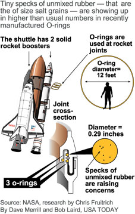

# Challenger disaster 

<!-- https://media.licdn.com/mpr/mpr/shrinknp_400_400/AAEAAQAAAAAAAAWnAAAAJDNmNDQ5ZmEwLWNhMjctNDUwZC1iZWExLTU4YzhiNzI2NGYxOQ.jpg -->

```{r setup, include=FALSE}
require(magrittr)
require(tidyverse)
require(knitr)
opts_chunk$set(collpase=TRUE, echo=FALSE)
```

The 1986 crash of the space shuttle Challenger was linked to failure
of O-ring seals in the rocket engines. Data was collected on the 23
previous shuttle missions. The launch temperature on the day of the
crash was 31C (J. Faraway citing Presidential Commission on the Space
Shuttle Challenger Accident, Vol. 1, 1986: 129-131.)


```{r, fig.align="center", fig.cap="What happened", out.width="80%", fig.show="hold"}


```


```{r, fig.align="center", fig.cap="Questioning the role of oring failure in Challenger disaster", out.width="50%", fig.show="hold"}


```
Let's investigate if the failure of the orings is related to temperature at the time of the mission departure. 

#Explore
```{r}
d <- read_csv("orings.csv") %>% mutate(temp=(temp-32)*4/9) #convert celcius
d 

#Is the success prob related to the temperature on the mission day


```

```{r}
d %>% 
  ggplot(aes(temp,damage))+
  geom_point() 
```

Let's fit a binomial regression to the data. To predict the probability of damage, use the following:

```{r}
bmod <- glm(cbind(damage,6-damage)~temp,d,family="binomial") 
bmod

summary(bmod) 


```

I checked that deviance equals 16.912 with 21 d.o.f. The pvalue turns out to be `r  pchisq(16.912,21,lower.tail=FALSE)`.

```{r}
pchisq(16.912,21,lower.tail=FALSE)
```

Because pvalue is greater than 5%, I am unable to reject the current model. (H0:Current model is correct)

 
Test $H_0: \beta\mathrm{temp}=0$. Using Wald test

```{r}
summary(bmod)

```
Because pvalue (4.78e-05) of z-test (Wald test) is practically zero, I reject the null hypothesis, which implies that temperature and number of damages are associated. (Coefficient is negative, negatively associated)


```{r}
predict(bmod,newdata=data.frame(temp=(31-32)*4/9),type="response") #On challenger day temperature was 31 degree Celcius. A disaster was almost certain on that day.
```

Let's plot the failure probability as a function of temperature.

To model probability of damage with binomial regression, I should feed to glm cbind(damage(success), failures) in other words cbind(damage, 6-damage). 

```{r}
beta <- coef(bmod)
plot((damage/6)~temp,d,xlim=c(-3,22),ylim=c(0,1)) #lets normalize the number of damages
curve(plogis(beta[1]+beta[2]*x),add=TRUE,col="red") 
abline(v=(31-32)*4/9,lty="dashed")  #temp observed on the day of the disaster
```

Let's calculate the confidence interval on the damage probability

```{r}


predict(bmod,newdata=data.frame(temp=(31-32)*4/9), se=TRUE) %>% #prediction gives you std errors
{.$fit+c(-1,0,1)*2*.$se.fit} %>% 
plogis() 


```


